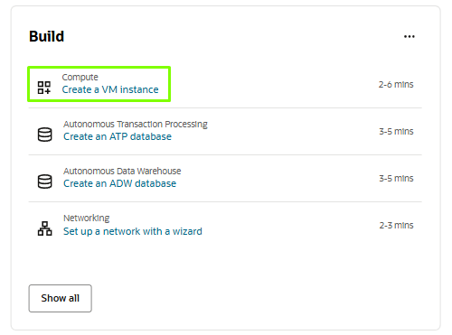
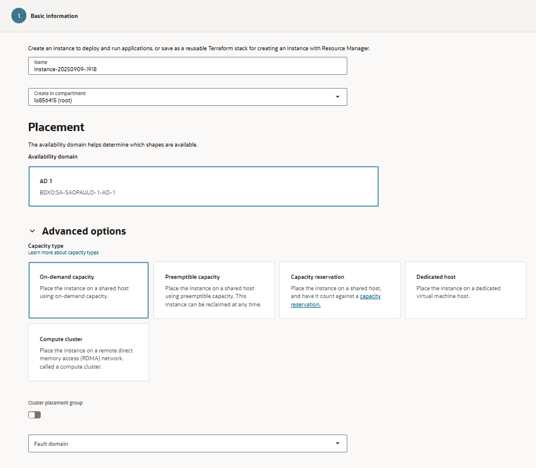
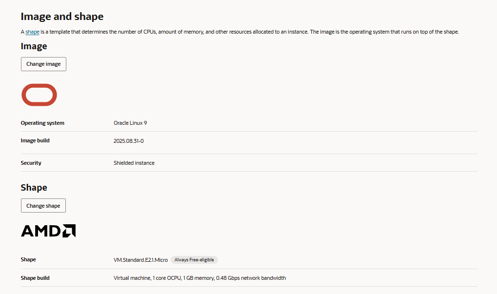
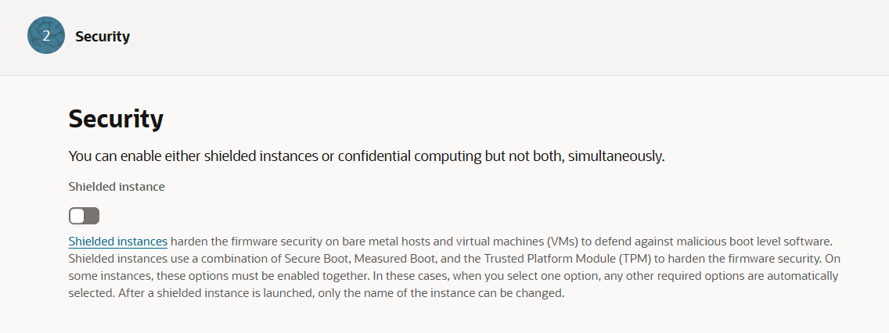
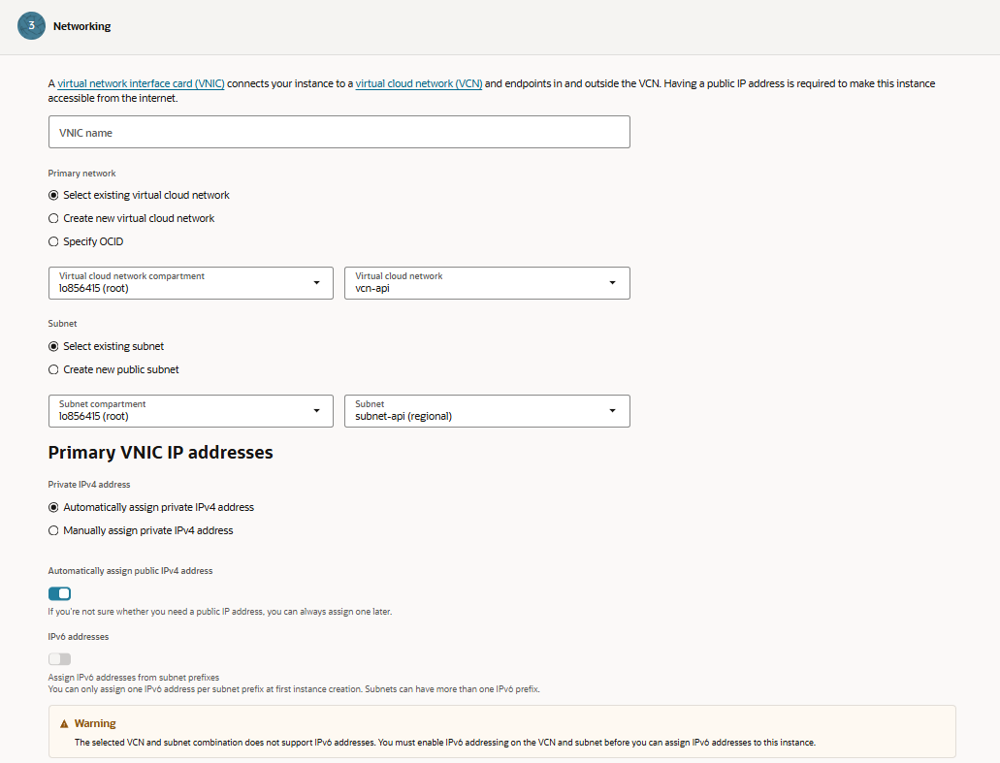
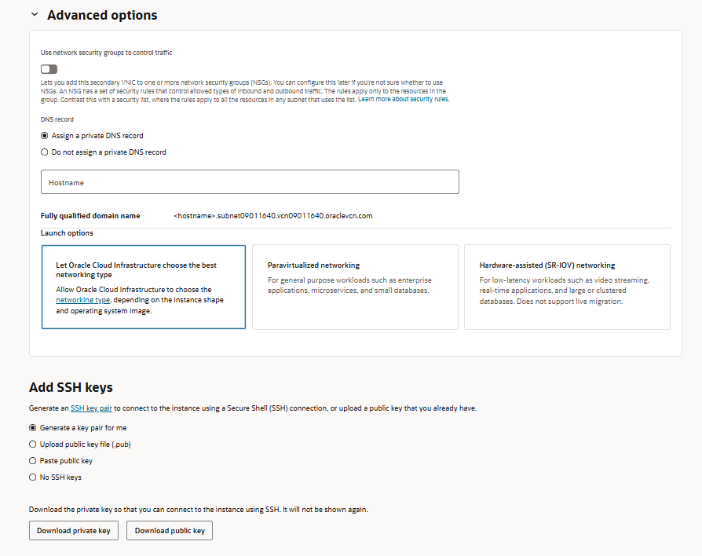
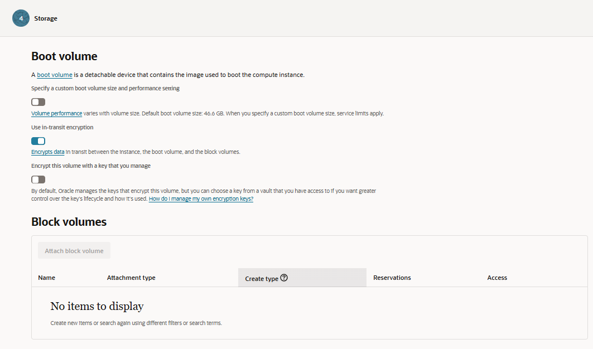

# vm-oraclecloud
Desafio de projeto da DIO: criação de máquina virtual com documentação

> Nota: Estou utilizando a versão `Always Free` do Oracle Cloud, alguns recursos da versão paga podem não estar disponíveis na minha revisão.

---

## Bloco de `Build` com Serviços


Existem alguns serviços presentes no Oracle Cloud, neste seguimento vou abordar a `Criação de Instância de Máquina Virtual` e uma estimativa de tempo para a criação de cada unidade, ao clicar no link você será redirecionado para a aba `Compute`

---

## Etapa 1 - Basic Information (Informação Básica)



Podemos observar algumas caixas de texto e de seleção, como por exemplo:

- **Name (Nome)**: Nome da instância que você está criando. Ex: `instance-20250909-1918`.
- **Compartment (Compartimento)**: O compartimento onde a instância será criada
> Por padrão o OCID (Oracle Cloud ID) utiliza uma versão simplificada do `tenancy` (conta da Oracle Cloud) e identifica um `root compartment` (Compartimento Raíz), contas pessoais costumam utilizar apenas um compartimento, é muito comum a criação de vários compartimentos em ambiente empresarial devido a separação de recursos do projeto.

### **Placement (Posicionamento)**

- **Availability Domain (Domínio de Disponibilidade)**

Define em qual domínio de disponibilidade (data center lógico dentro da região) a instância será provisionada. <br>Ex no print: `BDXQ:SA-SAOPAULO-1-AD-1` (Significa que minha instância será criada no data center da Oracle em São Paulo, sendo um serviço de **IaaS**). 

### Advanced Options (Opções Avançadas) - **Opcional**

- **Capacity Type (Tipos de Capacidade)**

1. On-demand capacity (Capacidade sob demanda)

É o padrão. A Oracle reserva os recursos de CPU/memória para você assim que criar a instância.<br>
**Vantagem**: garante que a VM sempre subirá quando você precisar.<br>
**Desvantagem**: custo mais alto.

2. Preemptible capacity (Capacidade preemptiva)

Instância criada com capacidade temporária que pode ser interrompida pela Oracle a qualquer momento, caso os recursos forem necessários em outro lugar.<br>
**Vantagem**: custo muito baixo, bom para testes ou processamento que pode ser interrompido.<br>
**Desvantagem**: instâncias podem ser encerradas a qualquer momento.<br>

3. Capacity reservations (Reserva de capacidade)

Você pode reservar antecipadamente recursos de CPU/memória numa região.
Útil em ambientes críticos onde você precisa garantir que sempre haverá recursos disponíveis.<br>
**Vantagem**: garante recursos disponíveis para ambientes críticos.<br>
**Desvantagem**: geralmente caro e voltado para empresas grandes.

4. Dedicated Host (Host dedicado)

Você aluga um servidor físico inteiro só para você, em vez de compartilhar com outros clientes (que é o padrão da nuvem).<br>
**Vantagem**: servidor físico exclusivo só para você, sem compartilhar recursos.<br>
**Desvantagem**: muito caro; não está incluso no Always Free.

5. Cluster Network (Compute Cluster)

Conjunto de várias instâncias Bare Metal ou instâncias com RDMA (Remote Direct Memory Access) interconectadas.<br>
**Vantagem**: alta performance e baixa latência para aplicações que exigem RDMA ou múltiplas VMs interconectadas.<br>
**Desvantagem**: complexo e caro; não está incluso no Always Free.

> somente os **recursos específicos** de VM do tipo `Always Free` estão isentos de cobrança.

### Cluster Placement Group (Grupo de Posicionamento de Cluster) - **Opção de Marcar**

É um recurso que mantém várias instâncias muito próximas fisicamente dentro do mesmo data center.

**Objetivo**: reduzir a latência de comunicação entre essas VMs. Ideal para aplicações que precisam trocar dados muito rápido, como bancos de dados distribuídos ou sistemas de alta performance.

**Vantagem**: comunicação extremamente rápida entre instâncias.<br>
**Desvantagem**: menor flexibilidade de alocação de recursos, e geralmente só disponível em instâncias pagas (não no Always Free).

### Fault Domain (Domínio de Falha) - **Opção de Seleção**

é uma subdivisão dentro de uma Availability Domain (uma grande zona dentro do data center). Cada fault domain tem hardware separado, racks diferentes, fontes de energia diferentes, etc.

**Objetivo**: aumentar a disponibilidade. Se uma falha afetar um rack, as VMs em outros fault domains continuam funcionando.

**Vantagem**: mais resiliência e tolerância a falhas sem precisar de backup manual.<br>
**Desvantagem**: não melhora desempenho de rede como o cluster placement group, e só funciona se você distribuir suas VMs entre fault domains.



### Image (Imagem)

É o sistema operacional que vai rodar na VM.

Determina: o software base que a instância vai usar para funcionar.
Ex:

Oracle Linux 9<br>
Build: 2025.08.31-0<br>
Security: Shielded instance (mais proteção contra ataques e manipulação)

### Shape (Formato)

é o “tamanho” ou “configuração” da máquina virtual.

Determina:

Número de CPUs (OCPUs)<br>
Quantidade de memória RAM<br>
Largura de banda de rede<br>
Outros recursos como GPU, se aplicável<br>

Ex: VM.Standard.E2.1.Micro

1 OCPU (1 CPU virtual)<br>
1 GB de RAM<br>
0.48 Gbps de rede

> Sempre Free-eligible, ou seja, essa configuração pode ser usada **sem gerar cobrança**.<br>

> Não vou abordar as Opções Avançadas para focar mais nos recursos principais para a criação da VM.

---

## Etapa 2 - Security (Segurança)



O recurso Shielded Instance serve para proteger a sua VM contra ataques a nível de firmware e boot, garantindo que ela seja confiável desde o momento em que é ligada.

Problema que resolve: softwares maliciosos podem tentar se instalar antes do sistema operacional (boot-level malware), o que é muito difícil de detectar depois. Shielded Instances evitam que isso aconteça.

Como funciona: combina três tecnologias de segurança:

- **Secure Boot**: garante que só softwares assinados e confiáveis sejam carregados no boot.

- **Measured Boot**: registra uma “assinatura” do processo de boot para verificar se não foi alterado.

- **Trusted Platform Module (TPM)**: chip virtual que armazena chaves de segurança, garantindo integridade e autenticidade do sistema.

Limitação: após criar a instância com Shielded Instance, você só pode alterar o nome da VM, não as configurações de segurança.

Uso típico: recomendado para ambientes críticos, servidores com dados sensíveis ou sistemas que exigem alta confiança de segurança.

---

## Etapa 3 - Networking (Rede)



### VNIC (Virtual Network Interface Card)

É como uma placa de rede virtual para VM.

Função: conecta a instância ao VCN (Virtual Cloud Network) e permite comunicação dentro da rede e com a internet (se houver IP público).

> Cada VM precisa de pelo menos um VNIC para funcionar na rede.

### **Public IP vs Private IP - Diferenças**

> **Private IPv4 address**: endereço usado apenas dentro do VCN (rede interna da nuvem).<br>**Public IPv4 address**: permite que a VM seja acessada diretamente da internet. Você pode escolher que ele seja atribuído automaticamente ou definir manualmente.

> Observação: se você não tem certeza, pode adicionar o IP público depois.

### VCN e Subnet

**VCN (Virtual Cloud Network)**: é a rede virtual que você cria na nuvem da Oracle. Funciona como uma rede privada em um datacenter.

**Subnet**: subdivisão da VCN que organiza os endereços IP. Pode ser pública (com acesso à internet) ou privada (sem acesso direto à internet).

> Cada VNIC precisa estar conectada a uma subnet dentro de uma VCN.

### **IPv6 (Indisponível)**

IPv6 é o próximo padrão de endereços de internet, maior que o IPv4.

Regras:

- Só dá para atribuir uma IPv6 por prefixo de subnet na criação da instância.<br>
- A subnet e a VCN precisam ter IPv6 habilitado antes de poder usar.<br>
- No seu caso, o aviso indica que a subnet atual não suporta IPv6, então não é possível atribuir um endereço IPv6 agora.



### Network Security Groups (NSGs)

Grupos que contêm regras de segurança de rede (firewall) aplicadas apenas aos recursos dentro do grupo.

- **Função**: controlar o tráfego inbound e outbound da VM.<br>
- **Diferença para Security Lists**: NSGs são aplicados apenas aos recursos que você adiciona, enquanto Security Lists valem para toda a subnet.<br>
- **Nota**: você pode configurar depois, se não tiver certeza agora.

### DNS Record

Opção de criar um registro DNS privado para sua VM.

- **Hostname**: nome que será usado dentro da VCN para acessar a VM.<br>
**Ex**: <hostname>.subnet09011640.vcn09011640.oraclevcn.com

Se não quiser acesso via DNS privado, pode escolher Do not assign a private DNS record.

### Launch options (Tipo de rede)

**"Let Oracle Cloud Infrastructure choose the best networking type"**: OCI escolhe automaticamente baseado na shape e imagem.<br>
**Paravirtualized networking**: boa para workloads gerais, como aplicações empresariais, microservices e bancos de dados pequenos.<br>
**Hardware-assisted (SR-IOV) networking**: baixa latência para workloads como streaming de vídeo, aplicações em tempo real e bancos de dados grandes/clusterizados.

> Limitação: não suporta live migration.

### SSH keys

SSH é a forma segura de acessar a VM pela internet.<br>

Opções:<br>
**Generate a key pair for me**: OCI cria par de chaves automaticamente (pública e privada).<br>
**Upload public key file (.pub)**: usar uma chave que você já possui.<br>
**Paste public key**: colar a chave pública manualmente.<br>
**No SSH keys**: não recomendado, pois você não terá acesso remoto seguro.

Depois de gerar ou fornecer a chave, você precisa baixar a private key, pois será usada para logar via SSH.

```
// Código para gerar chaves SSH via Terminal

ssh-keygen -t rsa -b 4096 -C "exemplo@exemplo.com"
```

Serão gerados dois arquivos:

>**id_rsa** → chave privada (não compartilhe)

>**id_rsa.pub** → chave pública (é essa que você envia para a Oracle Cloud ou outros servidores)

---

## Etapa 4 - Storage (Armazenamento)



### Boot Volume

é o disco principal da VM, contendo o sistema operacional (a Image que você escolher).

> Detachable: pode ser removido ou substituído sem apagar a VM, se necessário.

Tamanho e performance:

Padrão de Armazenamento: **46,6 GB**

> Você pode especificar um tamanho maior; volumes maiores geralmente têm melhor performance (mais IOPS e throughput).

> Atenção: limites de serviço se aplicam (não dá para criar volumes gigantes sem limite).

Segurança:

- **In-transit encryption**: criptografa os dados enquanto viajam entre a VM e os volumes de armazenamento.

- **Customer-managed key (CMK)**: você pode usar uma chave própria de um Vault para criptografar o volume, dando mais controle sobre o ciclo de vida da chave. Por padrão, a Oracle gerencia a chave para você.

## Block Volumes

Discos adicionais que você pode anexar à VM, além do boot volume.

Tipos de uso:

- Attach block volume: conectar o disco à VM existente.

- Attachment type: define como o volume se conecta (por exemplo, paravirtualized ou iSCSI).

- Create type: criar um volume novo ou usar um existente.

- Flexibilidade: você pode criar múltiplos block volumes, aumentar ou mover entre VMs conforme necessidade.

- Acesso: controla se o volume é somente leitura ou leitura/escrita.

---

### *Ao clicar no botão "Next" você será redirecionado para a etapa de **Review** para revisar a estrutura e fazer mudanças caso seja necessário e então clicar em "Create". Depois disso a VM vai estar configurada e pronta para uso.*

### Fim da Revisão.